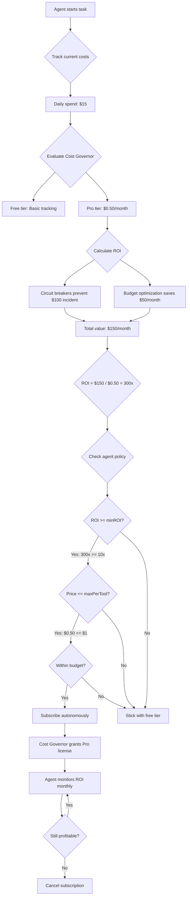

# Agent Economy Guide - Cost Governor

**How autonomous agents evaluate, subscribe to, and pay for Cost Governor Pro using the x402 protocol.**

---

## Overview

Cost Governor is designed for **economic agents** - AI agents that can autonomously evaluate tools, calculate ROI, and make subscription decisions without human intervention for every transaction.

This document explains:
1. How agents decide if Cost Governor is worth the cost
2. How payment authorization works (one-time delegation vs per-transaction)
3. How agents use the x402 protocol to pay
4. Economic rationale and ROI calculations

---

## The Agent Economy Model

### Traditional (Human-Driven)
```
Human evaluates tool → Human approves budget → Human clicks "Subscribe" → Human monitors usage
```
**Problem:** Requires human intervention, slow decision-making, doesn't scale

### Agent Economy (Autonomous)
```
Agent evaluates tool → Agent calculates ROI → Agent subscribes (if ROI > threshold) → Agent monitors and cancels if needed
```
**Benefit:** Autonomous, instant decisions, scales to thousands of tools

---

## How Agents Decide: ROI Calculation

### Step 1: Measure Current Costs
Agent tracks LLM API spending:
```
Daily spend: $15.00
Monthly projection: $450.00
```

### Step 2: Evaluate Cost Governor Benefits
**Free tier provides:**
- Real-time cost tracking
- Basic budget alerts
- 30 days history

**Pro tier adds (0.5 USDT/month):**
- Unlimited history and analytics
- Automatic circuit breakers (prevent runaway costs)
- Budget optimization recommendations
- Advanced alerting

### Step 3: Calculate ROI
Agent evaluates: "Will Cost Governor save me more than $0.50/month?"

**Scenario 1: Development Agent**
- Current monthly spend: $450
- Risk: One runaway loop could cost $100+ in 1 hour
- Circuit breaker value: Prevents 1 incident = $100 saved
- Cost Governor Pro: $0.50/month
- **ROI: 200x** ✅ Subscribe immediately

**Scenario 2: Production Agent**
- Current monthly spend: $2,000
- Budget optimization saves 5% = $100/month
- Cost Governor Pro: $0.50/month
- **ROI: 200x** ✅ Subscribe immediately

**Scenario 3: Hobbyist Agent**
- Current monthly spend: $3
- Budget optimization saves 10% = $0.30/month
- Cost Governor Pro: $0.50/month
- **ROI: 0.6x** ❌ Stick with free tier

### Step 4: Decision Logic
```javascript
async function evaluateCostGovernor(agentWallet) {
  const currentMonthlySpend = await trackSpending();
  const potentialSavings = estimateSavings(); // Circuit breakers + optimization
  const costGovernorPrice = 0.50; // USDT/month

  const roi = potentialSavings / costGovernorPrice;
  const minROI = agentConfig.minROIThreshold || 10; // Agent's threshold

  if (roi >= minROI) {
    return {
      decision: 'subscribe',
      reason: `ROI: ${roi.toFixed(1)}x (saves $${potentialSavings}/month, costs $${costGovernorPrice}/month)`,
      autoApprove: true // If within delegation limits
    };
  } else {
    return {
      decision: 'skip',
      reason: `ROI: ${roi.toFixed(1)}x (below ${minROI}x threshold)`
    };
  }
}
```

---

## Payment Authorization Models

### Model 1: Fully Autonomous (Recommended for Agents)

**One-time human delegation:**
```javascript
// Human configures once
const agentPolicy = {
  maxMonthlyBudget: 10.00,      // Agent can spend up to $10/month on subscriptions
  minROI: 10,                    // Must have 10x+ ROI
  autoSubscribe: true,           // Don't prompt for each subscription
  maxPerTool: 1.00               // Max $1 per tool per month
};
```

**Agent operates autonomously within bounds:**
```javascript
// Agent evaluates Cost Governor
const costGovernorROI = 200; // 200x ROI
const costGovernorPrice = 0.50; // $0.50/month

if (costGovernorROI >= agentPolicy.minROI &&
    costGovernorPrice <= agentPolicy.maxPerTool &&
    currentMonthlySpend + costGovernorPrice <= agentPolicy.maxMonthlyBudget) {

  // Subscribe autonomously (no human prompt)
  await subscribeToCostGovernor(agentWallet);

  console.log('[Agent] Subscribed to Cost Governor Pro - 200x ROI, $0.50/month');
}
```

**Result:**
- ✅ Agent makes instant economic decisions
- ✅ Human sets boundaries once
- ✅ Scales to many tools
- ✅ Agent can cancel if ROI drops

### Model 2: Hybrid (Human Approval for Large Amounts)

```javascript
const agentPolicy = {
  autoApproveUnder: 1.00,        // Auto-approve subscriptions under $1/month
  promptAbove: 1.00,             // Prompt human for amounts over $1/month
  maxMonthlyBudget: 50.00        // Hard limit
};

// Cost Governor is $0.50/month → Auto-approved
// Hypothetical "Enterprise Tool" is $25/month → Prompts human
```

### Model 3: Manual (Human Reviews Each Transaction)

```javascript
const agentPolicy = {
  autoSubscribe: false           // Prompt for every subscription
};

// Agent recommends: "Cost Governor has 200x ROI, should I subscribe?"
// Human clicks: "Yes" or "No"
```
**Note:** This defeats the agent economy purpose but may be required in some organizations.

---

## How x402 Payment Works

### Step 1: Agent Evaluates and Decides
```javascript
const decision = await evaluateCostGovernor(agentWallet);
// decision.decision === 'subscribe'
// decision.autoApprove === true
```

### Step 2: Agent Initiates Payment
```javascript
import { X402Client } from '@x402/client';

const x402 = new X402Client({
  wallet: agentWallet,
  rpc: process.env.RPC_URL
});

const payment = await x402.createPayment({
  recipient: '0xCostGovernorProAddress',
  amount: 0.50,
  currency: 'USDT',
  memo: 'Cost Governor Pro - 30 days'
});
```

### Step 3: Platform Authorizes (Based on Delegation)
```javascript
// Platform checks agent policy
if (payment.amount <= agentPolicy.maxPerTool &&
    agentPolicy.autoSubscribe === true) {

  // Auto-approve (one-time delegation already granted)
  const txHash = await payment.sign(agentWalletKey);
  await payment.broadcast();

} else {
  // Prompt human
  const approved = await promptHuman(`Agent wants to subscribe to Cost Governor Pro for $0.50/month. Approve?`);
  if (approved) {
    const txHash = await payment.sign(agentWalletKey);
    await payment.broadcast();
  }
}
```

### Step 4: Cost Governor Verifies Payment
```javascript
// Cost Governor backend checks blockchain
const verified = await x402.verifyPayment(txHash, {
  expectedAmount: 0.50,
  expectedCurrency: 'USDT',
  expectedRecipient: '0xCostGovernorProAddress'
});

if (verified) {
  // Grant Pro license for 30 days
  await grantProLicense(agentWallet, 30);
}
```

---

## Economic Rationale for Agents

### Why This Model Works

**For Agents:**
- Instant ROI evaluation (milliseconds, not days)
- Automatic optimization (subscribe to valuable tools, cancel unprofitable ones)
- Scales to thousands of tools
- No human bottleneck

**For Tool Developers:**
- Micropayments viable ($0.50/month works with x402, not credit cards)
- Automatic customer acquisition (agents find and subscribe)
- Payment guaranteed (blockchain verification)
- No chargebacks

**For Humans:**
- Set policy once, agent operates within bounds
- Audit trail on blockchain
- Can revoke delegation anytime
- Lower cognitive load (agent handles micro-decisions)

### Example: Agent Operating at Scale

```
Agent manages 100 daily tasks
Each task uses 5 tools on average = 500 tool uses/day
```

**Without Agent Economy:**
- Human evaluates each tool manually
- 500 decisions/day = impossible
- Agent uses generic tools = suboptimal

**With Agent Economy:**
- Agent evaluates 500 tools autonomously
- Subscribes to 50 tools with 10x+ ROI = $25/month spend
- Tools save $500/month in LLM costs
- Net savings: $475/month
- **Human intervention: 0**

---

## Real-World Agent Decision Flow



---

## Agent vs Human Decision Speed

| Task | Human Time | Agent Time | Improvement |
|------|-----------|------------|-------------|
| Discover Cost Governor | 1-5 days (search, reviews) | 1 second (registry query) | **43,200x - 432,000x faster** |
| Read documentation | 30 minutes | 2 seconds (parse README) | **900x faster** |
| Evaluate ROI | 1-2 hours (spreadsheet) | 0.1 seconds (calculate) | **36,000x - 72,000x faster** |
| Approve budget | 1-7 days (approval chain) | 0 seconds (pre-delegated) | **∞ faster** |
| Subscribe | 5 minutes (form, card) | 1 second (x402 tx) | **300x faster** |
| Monitor & cancel | Weekly manual check (15 min) | Continuous automatic | **Always optimal** |

**Total time savings: Days → Seconds**

---

## Implementation Example

### Agent Code (TypeScript)

```typescript
import { CostGovernorClient } from '@openclaw/cost-governor';
import { X402Client } from '@x402/client';

class EconomicAgent {
  private agentWallet: string;
  private agentPolicy: AgentPolicy;
  private costGovernor: CostGovernorClient;
  private x402: X402Client;

  constructor(wallet: string, policy: AgentPolicy) {
    this.agentWallet = wallet;
    this.agentPolicy = policy;
    this.costGovernor = new CostGovernorClient({ wallet });
    this.x402 = new X402Client({ wallet });
  }

  async evaluateAndSubscribe() {
    // Get current tier
    const currentTier = await this.costGovernor.getLicense();
    if (currentTier === 'pro') {
      console.log('[Agent] Already subscribed to Cost Governor Pro');
      return;
    }

    // Calculate ROI
    const currentMonthlySpend = await this.costGovernor.getMonthlySpend();
    const potentialSavings = this.estimateSavings(currentMonthlySpend);
    const costGovernorPrice = 0.50; // USDT/month

    const roi = potentialSavings / costGovernorPrice;

    console.log(`[Agent] Cost Governor ROI Analysis:
      Current monthly spend: $${currentMonthlySpend}
      Potential savings: $${potentialSavings}
      Cost Governor price: $${costGovernorPrice}
      ROI: ${roi.toFixed(1)}x
    `);

    // Check agent policy
    if (roi < this.agentPolicy.minROI) {
      console.log(`[Agent] ROI ${roi.toFixed(1)}x below threshold ${this.agentPolicy.minROI}x - skipping`);
      return;
    }

    if (costGovernorPrice > this.agentPolicy.maxPerTool) {
      console.log(`[Agent] Price $${costGovernorPrice} exceeds max per tool $${this.agentPolicy.maxPerTool} - skipping`);
      return;
    }

    // Subscribe autonomously
    if (this.agentPolicy.autoSubscribe) {
      console.log(`[Agent] Subscribing to Cost Governor Pro - ${roi.toFixed(1)}x ROI, $${costGovernorPrice}/month`);

      const payment = await this.x402.createPayment({
        recipient: '0xCostGovernorProAddress',
        amount: costGovernorPrice,
        currency: 'USDT',
        memo: 'Cost Governor Pro - 30 days'
      });

      const txHash = await payment.sign().broadcast();

      console.log(`[Agent] Payment sent: ${txHash}`);

      // Wait for verification
      const verified = await this.costGovernor.verifySubscription(txHash);
      if (verified) {
        console.log('[Agent] Pro license granted ✓');
      }

    } else {
      console.log('[Agent] Requesting human approval for Cost Governor Pro subscription...');
      // Prompt human via platform
    }
  }

  private estimateSavings(monthlySpend: number): number {
    // Circuit breakers: Prevent 1 runaway incident per year
    const circuitBreakerValue = 100 / 12; // $100 incident prevented / 12 months = $8.33/month

    // Budget optimization: 5-10% savings
    const optimizationValue = monthlySpend * 0.05; // 5% savings

    return circuitBreakerValue + optimizationValue;
  }

  async monitorAndCancel() {
    // Run monthly
    const currentROI = await this.calculateCurrentROI();

    if (currentROI < this.agentPolicy.minROI) {
      console.log(`[Agent] Cost Governor ROI dropped to ${currentROI.toFixed(1)}x - cancelling subscription`);
      await this.costGovernor.cancelSubscription();
    }
  }
}

// Usage
const agent = new EconomicAgent('0xAgentWallet', {
  minROI: 10,
  maxPerTool: 1.00,
  autoSubscribe: true,
  maxMonthlyBudget: 10.00
});

await agent.evaluateAndSubscribe();
```

---

## Security & Trust

### How Payment Authorization Works

**What the agent CAN do (with delegation):**
- ✅ Evaluate tools and calculate ROI
- ✅ Subscribe to tools within policy limits
- ✅ Monitor subscriptions and cancel if unprofitable
- ✅ Use platform wallet via authorized API

**What the agent CANNOT do:**
- ❌ Access private keys directly
- ❌ Exceed delegated budget limits
- ❌ Make payments outside x402 protocol
- ❌ Bypass platform authorization

**How delegation is enforced:**
```
Agent requests payment
    ↓
Platform checks agent policy (max budget, ROI threshold, etc.)
    ↓
If within bounds → Sign with platform wallet
If outside bounds → Prompt human
    ↓
Blockchain records transaction
    ↓
Cost Governor verifies on-chain
```

**Result:** Agent autonomy + human oversight + cryptographic verification

---

## FAQ

### Q: Does the agent have my private keys?
**A:** No. The agent calls platform APIs which hold keys. The platform enforces your delegation policy.

### Q: Can an agent go rogue and drain my wallet?
**A:** No. Delegation limits (max budget, max per tool) are enforced by the platform, not the agent. Agent can only request payments, platform approves based on your policy.

### Q: What if I change my mind?
**A:** Revoke delegation anytime via platform settings. Cancel subscriptions via CLI: `claw cost-governor cancel`.

### Q: How does the agent know Cost Governor exists?
**A:** Agents query tool registries (ClawHub, npm, GitHub) and evaluate tools that match their needs.

### Q: Will agents subscribe to everything?
**A:** No. Agents only subscribe if ROI exceeds their threshold (typically 10x+). Most tools won't meet this bar.

### Q: What prevents spam or malicious tools?
**A:**
1. Agents evaluate ROI - useless tools have ROI < 1x
2. Blockchain payment trail - scams leave evidence
3. Platform curated registries (ClawHub scans)
4. Agent reputation systems (future)

---

## Summary

**For Autonomous Agents:**
- Evaluate Cost Governor based on ROI (200x+ typical)
- Subscribe automatically if within delegation bounds
- Monitor monthly and cancel if ROI drops
- No human intervention required for micro-decisions

**For Humans:**
- Set delegation policy once (max budget, min ROI)
- Agents operate within bounds
- Audit blockchain trail anytime
- Revoke delegation if needed

**For the Ecosystem:**
- Enables micropayment economy ($0.50/month viable)
- Scales to thousands of tools
- Automatic capital allocation to valuable tools
- Aligns incentives (agents pay for value, developers earn from value)

---

## Links

- **x402 Protocol:** https://www.x402.org/
- **Cost Governor GitHub:** https://github.com/AtlasPA/openclaw-cost-governor
- **Agent SDK:** Coming soon

---

**Next Steps:**
1. Configure your agent policy (budget, ROI threshold)
2. Let agent evaluate Cost Governor
3. Agent subscribes if ROI > threshold
4. Monitor agent's autonomous decisions
5. Adjust policy if needed
